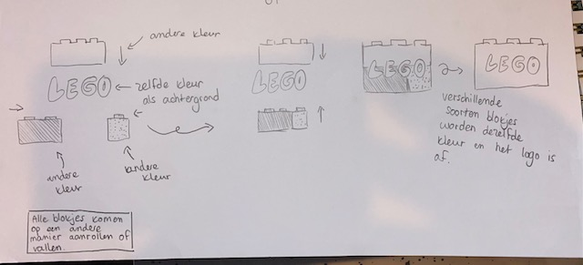
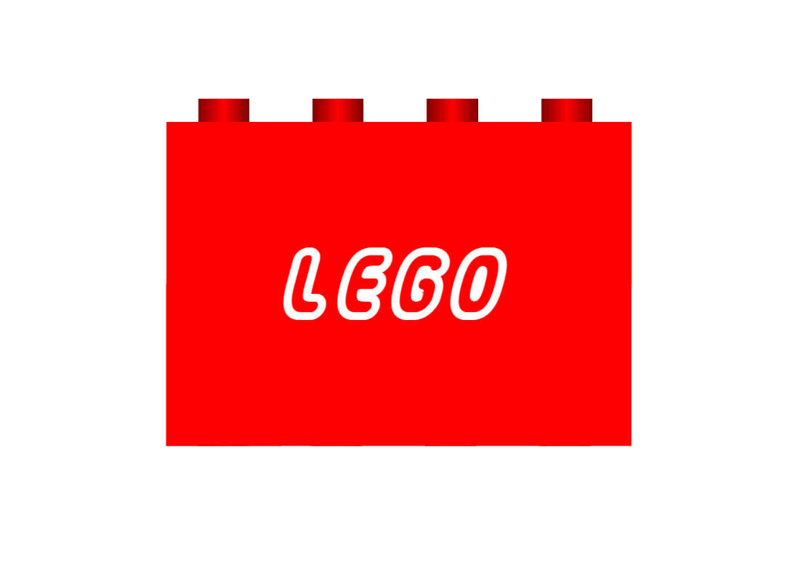
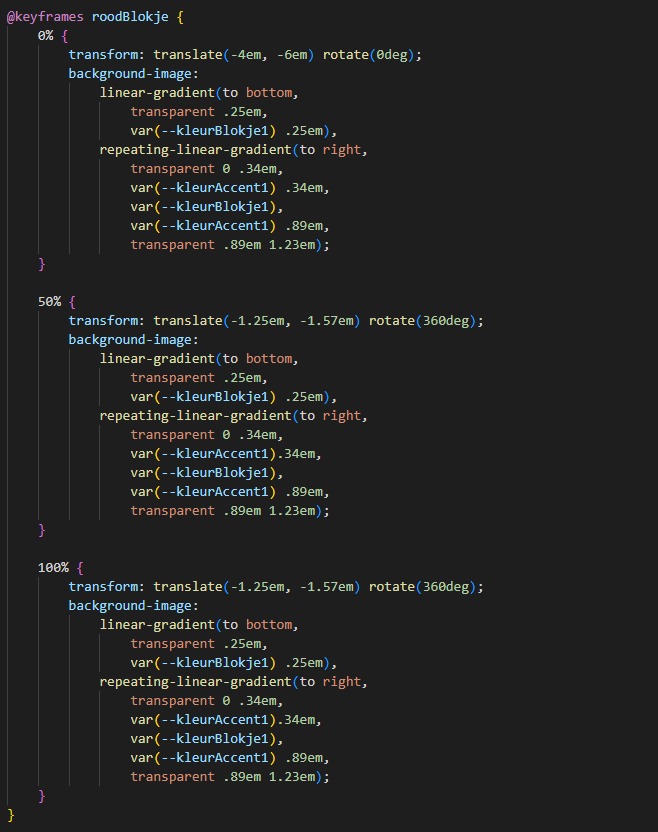
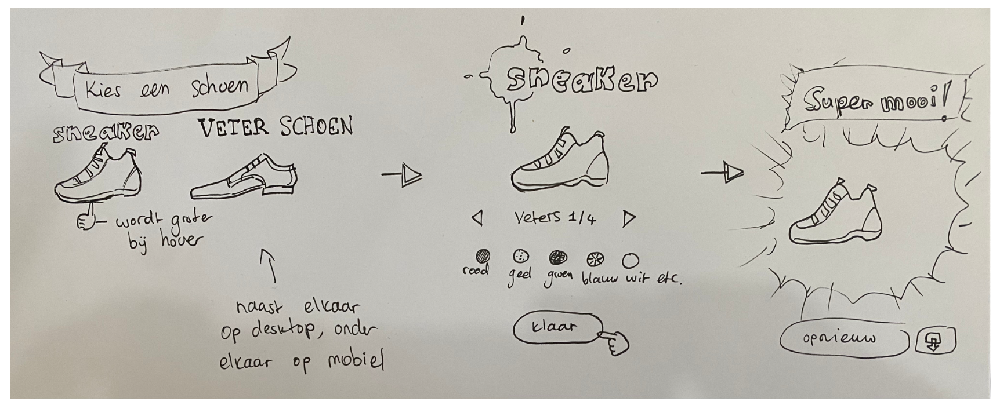
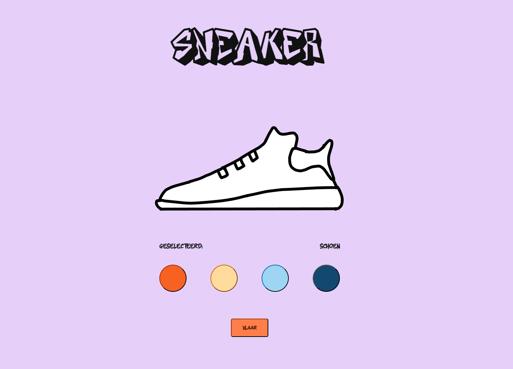
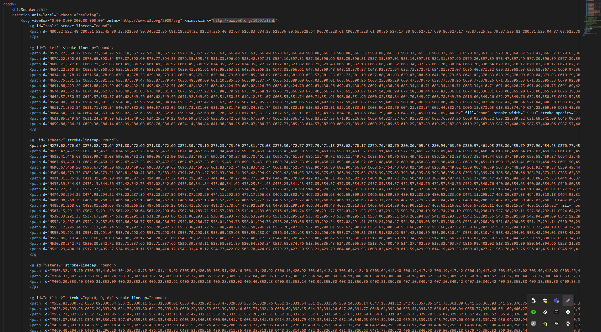
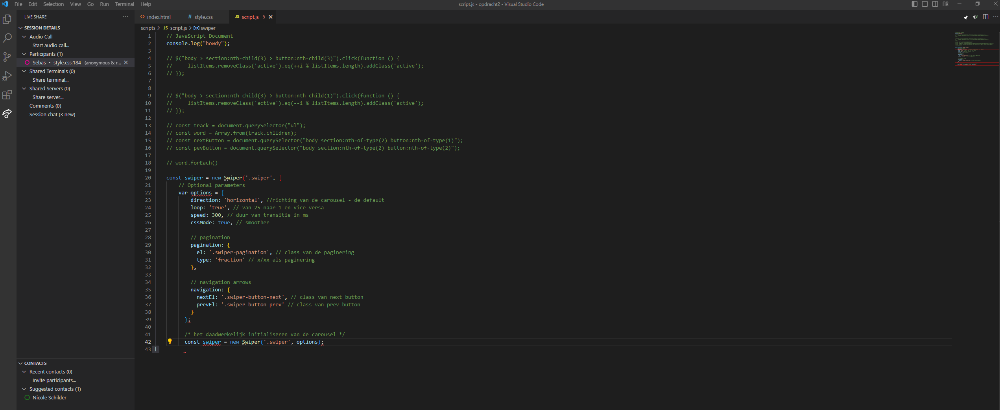

# Procesverslag
**Auteur:** Nicole Schilder

**De opdrachten:** [opdracht 1](opdracht1/index.html) en [opdracht 2](opdracht2/index.html)

Markdown is een simpele manier om HTML te schrijven.  
Markdown cheat cheet: [Hulp bij het schrijven van Markdown](https://github.com/adam-p/markdown-here/wiki/Markdown-Cheatsheet).

Nb. De standaardstructuur en de spartaanse opmaak van de README.md zijn helemaal prima. Het gaat om de inhoud van je procesverslag. Besteedt de tijd voor pracht en praal aan je website.

Nb. Door *open* toe te voegen aan een *details* element kun je deze standaard open zetten. Fijn om dat steeds voor de relevante stuk(ken) te doen.

## Bronnenlijst
  1. http://www.w3.org/2000/svg
  2. http://www.w3.org/1999/xlink
  3. 

## Opdracht 1 plan

  
uitwerken na schetsen idee (voor week 2)

  ### Je storyboard:

  ### Je ambitie: 
  Aan deze technieken/punten wil ik werken:
  - Ik wil een beter begrip hebben voor hoe animaties werken, zodat ik zelf hele coole dingen kan bedenken die ik kan gebruiken
  in mijn toekomstige designs.
  - Ik wil meer leren over hoe ik een website compleet responsive kan maken.
  
  ### Feedback van Ufuk
  - Het concept past goed bij de logo stijl. Lego die met bouwblokken zichzelf bouwt valt prima in de style.
  - De blokjes zijn alle 3 een ander textuur, en dat brengt goed detail in de animatie.
  - De animatie formaat is vierkant en valt dus goed te scalen op verschillende formaten.
  - Voor de dark mode, speel met de kleuren, dus wat hiervoor wit was, zwart maken.
  - Kijk hoe je de lego in html css kan maken. En misschien kun je kijken hoe je elke letter een lego blokje maakt.
 

## Opdracht 1 reflectie

  
uitwerken bij afronden opdracht (voor week 3)

  ### Je uitkomst - karakteristiek screenshot(s):
  

  ### Dit ging goed/Heb ik geleerd: 
  Ik begrijp beter hoe animaties werken in css en ik heb geleerd hoe je met after and before dingen kunt toevoegen. Ook ben ik iets beter geworden in responsivness. 

  ### Dit was lastig/Is niet gelukt:
  Ik vond het eerst lastig om een logo blokje te maken, maar Sanne heeft me heel goed uitgelegd hoe ik dat eigenlijk heel makkelijk kon doen met linear gradients.

  

## Opdracht 2 plan

  
uitwerken na schetsen idee (voor week 4)

  ### Je ontwerp:
  

  ### Je ambitie: 
  Aan deze technieken/punten wil ik werken:
  - Javascript begrijpen
  - Toegankelijkheid
  

## Opdracht 2 test

  
uitwerken na testen (week 6/7)

  Neem minimaal 5 bevindingen op:

  ### Bevinding 1:
  Ik wil de svg's die op elkaar staan apart kunnen aanklikken, maar dat gaat niet, doordat het onzichtbare deel van de svg niet als onzichtbaar wordt gezien.

  #### oplossing:
  alle svg's samenvoegen in een svg element in de html. Ziet er niet uit, maar hierdoor kan ik puur de delen van mijn svg waar daadwerkelijk content is aanklikken.

  ### Bevinding 2:
  Het lukt mij maar niet om een carousel te maken en ook niet om een library te gebruiken hiervoor.

  #### oplossing:
  Ik heb de carousel weggehaald. selecteren doe je door de delen van de schoen aan de klikken en onder de schoen staat aangegeven welk deel van de schoen is geselecteerd. Volgende keer moet ik mij meer verdiepen in hoe javascript werkt om dit goed te kunnen verwezenlijken. Of beter worden met libraries. 

  ### Bevinding 3:
  Het onzichtbare deel van de svg lijkt soms de overlappen met de middelste buttons waarmee je de kleuren kiest. Hierdoor kan je er niet altijd op klikken. Het is me nog niet helemaal gelukt om dit op te lossen. Volgende keer maak ik de svg's gewoon met veel minder witruimte, dan kan ik dit voortaan voorkomen.
  
  ### Bevinding 4:
  Het javascript gedeelte vond ik enorm lastig. Ik ben nog niet zo bekend met javascript en ik vind uitleg niet altijd even duidelijk. Mijn code had veel korter gekund volgens mijn vriend, maar ik heb het gelaten voor wat het is, omdat ik het anders niet meer begreep. Ik moet echt een cursus javascript gaan doen denk ik.
  
   ### Bevinding 5:
  Al met al had ik hier meer tijd voor moeten vrij maken en moet ik leren omgaan met stress, want door de stress kon ik niet meer goed nadenken en kwam er niks meer binnen, waardoor ik het allemaal minder goed begreep en hierdoor heb ik minder kunnen doen dan ik had gewild.

## Opdracht 2 reflectie

  
uitwerken bij afronden opdracht (voor week 8)

  ### Je uitkomst - karakteristiek screenshot(s):
  

  ### Dit ging goed/Heb ik geleerd: 
  Ik vond de tweede opdracht een stuk lastiger. Ik was er laat aan begonnen, doordat ik veel tijd kwijt was aan project visual en dacht het wel te redden met een extra weekje als ik voor de herkansing zou gaan. Maar het was toch lastiger dan ik dacht. Ik heb een beetje meer geleerd over Javascript en hoe je svg's klikbaar kan maken, puur met alleen de code van de svg. (is lastig uit te leggen zonder de code erbij)

  

  ### Dit was lastig/Is niet gelukt:
  De hele carousel is niet gelukt. Ik ben hier best veel tijd aan kwijt geraakt en op een gegeven moment moest ik alleen maar huilen, omdat het niet wilde lukken. Nu kan ik er om lachen, maar het was echt niet leuk. Ik heb tussendoor een screenshot gemaakt van code die ik niet had gebruikt, maar wel had geprobeerd.

  

